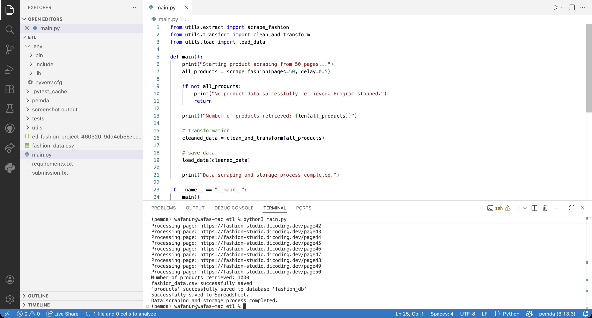
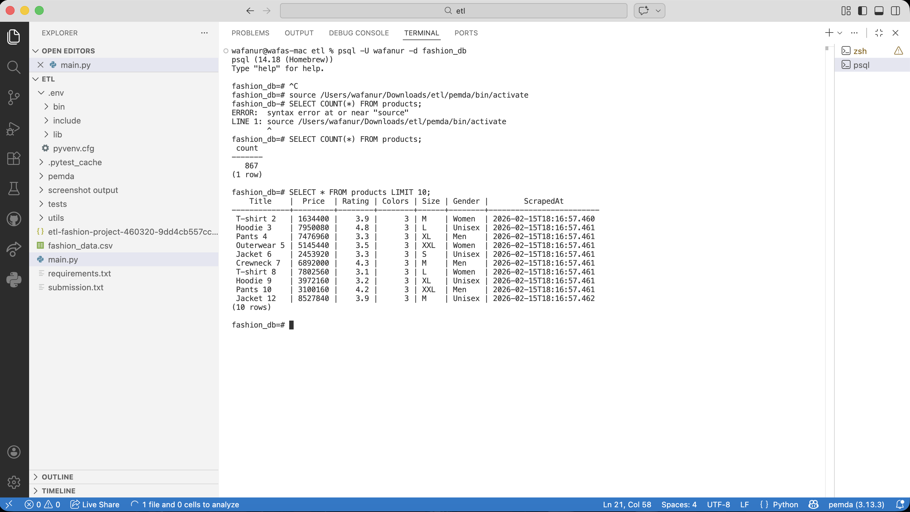
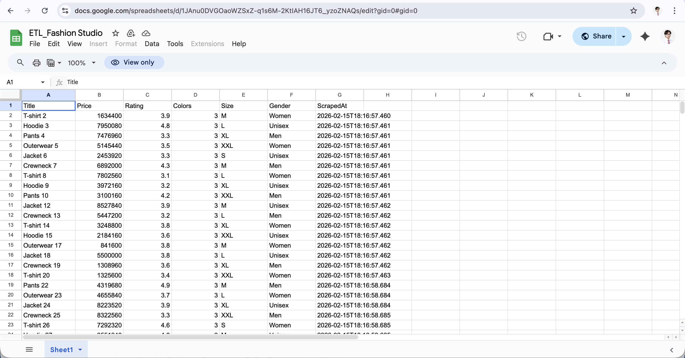

# 🛍️ E-Commerce Fashion Data: End-to-End ETL Pipeline

**Author:** Fatwa Nurhidayat  
**Focus:** Data Engineering, Modular Python, Web Scraping, and Unit Testing.

---

## 📊 Project Overview

This project is a fully functional, end-to-end **Extract, Transform, and Load (ETL) pipeline** designed to harvest, clean, and store e-commerce fashion data. 

Unlike traditional notebook-based analysis, this project adopts a strict **Modular Code Architecture**. The pipeline is broken down into separate, maintainable Python scripts (`extract.py`, `transform.py`, `load.py`), ensuring scalability, ease of debugging, and production readiness. 

**Key Achievements:**
- Successfully scraped and processed 1,000 product records across 50 paginated web pages.
- Implemented robust error handling across all pipeline stages.
- Validated code reliability through comprehensive unit testing with over **80% test coverage**.
- Configured multi-destination data loading (CSV, Google Sheets API, and PostgreSQL).

---

## 🏗️ Architecture & Project Structure

The repository follows a professional software engineering directory structure:

    fashion-etl-pipeline/
    ├── screenshots/           <-- Execution proofs
    ├── tests/                 <-- Unit test modules
    ├── utils/
    │   ├── extract.py         <-- Web scraping logic
    │   ├── transform.py       <-- Data cleansing & type casting
    │   └── load.py            <-- Multi-destination storage logic
    ├── main.py                <-- Pipeline orchestrator
    ├── requirements.txt
    └── README.md

---

## 📸 Pipeline Execution Proof

To demonstrate the pipeline's reliability, here are the outputs generated from a successful execution extracting 1,000 product records:

### 1. Successful Pipeline Execution (Terminal)
> The script successfully scraped 50 pages, processed 1000 items, and distributed the data to all three repositories without failing.



### 2. Relational Database Load (PostgreSQL)
> Data successfully loaded and verifiable via `psql` querying in the command line.



### 3. Cloud Storage Load (Google Sheets API)
> Real-time data availability for business stakeholders.



### 4. Flat File Generation (CSV)
> Cleaned data exported to a local `.csv` file.


---

## ⚙️ ETL Pipeline Workflow

1. **Extract (`utils/extract.py`):** Automated web scraping targeting multiple data points (`Title`, `Price`, `Rating`, `Colors`, `Size`, `Gender`). Includes an automated `timestamp` column.
2. **Transform (`utils/transform.py`):** Converted USD to IDR, purged null/invalid entries, stripped unnecessary strings, and enforced strict data typing.
3. **Load (`utils/load.py`):** Cleaned data is loaded simultaneously into a Flat File (.csv), Cloud Spreadsheet (Google Sheets API), and a Relational Database (PostgreSQL).

---

## 🧪 Unit Testing & Quality Assurance

To guarantee the reliability of the pipeline, **Unit Tests** were written for every custom function within the ETL process using `pytest` and `unittest`. All tests are isolated within the `tests/` directory, achieving an **Advanced-level coverage**.

---

## 🚀 How to Run the Pipeline

1. Clone this repository:
   ```bash
   git clone [https://github.com/fatwanurhdyt/Ecommerce-ETL-Pipeline.git](https://github.com/fatwanurhdyt/Ecommerce-ETL-Pipeline.git)

2. Install the required dependencies:
    pip install -r requirements.txt

3. Execute the main pipeline:
    python3 main.py
